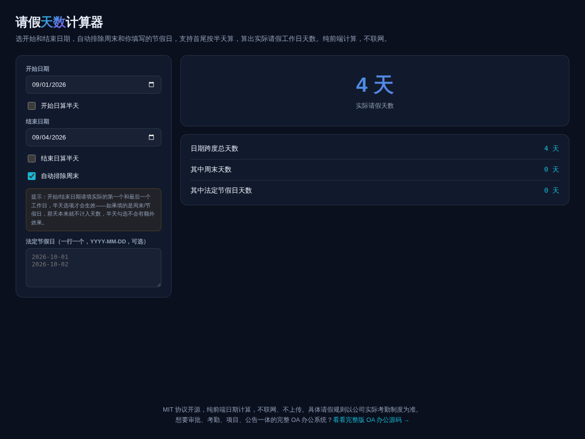

# 请假天数计算器 · Leave Days Calculator

**[在线体验 →](https://anna123123123-creator.github.io/leave-calc/)**

免费开源、纯浏览器运行的请假天数计算工具。选开始和结束日期，自动排除周末和你填写的法定节假日，支持首尾按半天算，算出实际请假工作日天数。纯前端计算，不联网、不上传。



## 试用方法

直接用浏览器打开 `index.html`，或用静态文件服务器跑起来：

```bash
python3 -m http.server 8000
```

开始/结束日期请填实际的第一个和最后一个工作日，半天选项才会生效——如果填的是周末/节假日，那天本来就不计入天数，半天勾选不会有额外效果。

## 计算规则

逐天遍历开始到结束日期（含首尾），排除周末（可关闭）和你填写的节假日列表，首尾工作日可分别标记为半天。

## 协议

MIT。

## 需要定制版？

这个工具免费开源、可以直接用。如果你需要的是**改造成适合自己业务的版本**——换品牌、改字段、加功能、接后端或数据库——我可以做。

- **交付周期**：3–10 个工作日
- **交付内容**：完整源码（不加密、可自行二次开发）+ 在线地址 + 部署说明
- **已有 49 套现成系统**可直接改造，覆盖电商、教育、门店、内容、跨境等行业：[全部清单与在线演示](https://inzyxuashop.com)

把你的需求发给我，24 小时内回复可行性与报价：**evcdecd@gmail.com**
